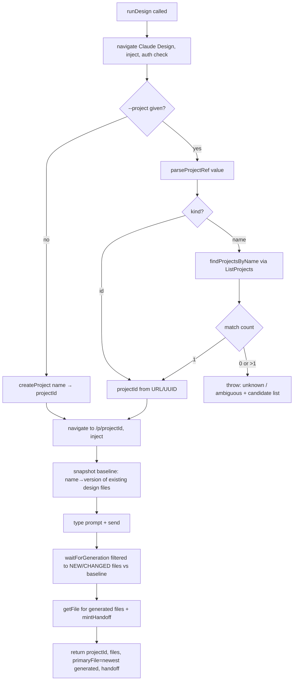

# feat: Target an existing Claude Design project with `--project`

## Summary

Add an optional `--project <url | uuid | name>` flag to auteur's run command that sends the
prompt into an **existing** Claude Design project instead of creating a fresh one. Sending into
an existing project means the new design inherits that project's existing files and design system,
so it stays consistent with an established theme (e.g. iterating within the "Skillet" project).

The flag accepts three reference forms — a project URL, a bare UUID, or a project **name** resolved
through the `ListProjects` RPC. Because a reused project already contains files, the generation
wait logic must detect the **newly created or changed** file (not the pre-existing ones) and point
the handoff at it. The capability is also surfaced through the `/auteur` skill so an agent can act
on natural phrasing like "using the Skillet project" or a pasted project link.

---

## Problem Frame

Today every `auteur "<prompt>"` run calls `CreateProject` and generates into a brand-new, empty
project (`src/design.js` `runDesign` → `createProject`). There is no way to:

- Keep a new design consistent with an existing project's theme / design system.
- Iterate on or extend an existing project's designs from the CLI.

Users think of their projects by **name** ("Skillet") or by the **link** they copied from
claude.ai/design — not by internal UUID. The feature must accept all three and fail clearly when a
name is ambiguous or unknown, rather than silently targeting the wrong project.

A second, less obvious problem: `waitForGeneration` currently treats "a design file exists and is
stable" as done. In a reused project that already has stable files, that condition is true the
instant we arrive, so the run would "complete" without waiting for the new design. Completion must
be redefined relative to a **baseline snapshot** taken before the prompt is sent.

---

## Requirements

- **R1.** `--project <value>` is optional; absence preserves today's create-new-project behavior exactly.
- **R2.** `<value>` is accepted as a project URL (`https://claude.ai/design/p/<uuid>?...`), a bare UUID, or a project name.
- **R3.** Name resolution uses an exact, case-insensitive match against `ListProjects`. Zero matches or more than one match is a hard error that lists candidate projects (name + URL) so the user can re-run with a precise reference. _(Decision per user: exact-match, error-on-ambiguity.)_
- **R4.** When a project is targeted, `CreateProject` is **not** called; the prompt is sent into the resolved project.
- **R5.** The run detects the file generated **by this prompt** (new file, or an existing file whose version changed) and uses it for the handoff `open_file` and the returned `primaryFile` — never a pre-existing, untouched file.
- **R6.** The generated design + handoff are returned the same way as the create-new path (no change to the result shape or the handoff format).
- **R7.** The `/auteur` skill instructs the agent to translate "use the <Name> project" or a pasted project URL into `auteur --project "<ref>" "<prompt>"`.
- **R8.** Clear, actionable errors for: unknown name, ambiguous name, and a project that can't be reached/loaded.

---

## Key Technical Decisions

- **KTD1 — Classify the reference with a pure function, resolve names with the page.** A pure
  `parseProjectRef(value)` returns `{ kind: "id", projectId }` for a URL or bare UUID (no network),
  or `{ kind: "name", name }` otherwise. Name → projectId resolution needs the authenticated page
  (it calls `ListProjects`), so it happens inside `runDesign` after the auth check. Keeping URL/UUID
  parsing pure makes it unit-testable without a browser, matching how the rest of auteur isolates
  page-context work behind small helpers.

- **KTD2 — Resolve names through a new INPAGE helper, return all matches.** Add
  `findProjectsByName(name)` to the `window.__auteur` INPAGE block in `src/design.js`. It lists
  projects and returns every exact (case-insensitive) match as `{ projectId, name, url }`. The Node
  side decides the outcome (1 → use it; 0 or >1 → throw with the candidate list). Returning matches
  rather than throwing in-page keeps the error message construction on the Node side where the other
  user-facing errors live.

- **KTD3 — Baseline-diff for generated-file detection.** Before sending the prompt, snapshot the
  current design files as a `name → version` map (the `version` field already distinguishes
  revisions; `support.js` is already excluded by `designFiles`). `waitForGeneration` accepts this
  baseline and computes the **generated set** = design files that are new (name not in baseline) or
  changed (version differs). "Done" is defined over the generated set, not all design files. For the
  create-new path the baseline is empty, so behavior is identical to today (every file is "new").

- **KTD4 — `--project` reuses; `--name` is for creating.** `--name` only names a freshly-created
  project. When `--project` is present the run reuses an existing project, so `--name` is ignored
  (documented). They are not combined.

- **KTD5 — Design-system inheritance is implicit.** Claude Design already uses a project's existing
  files / design system as context for a new prompt within that project. auteur does not need to
  attach anything extra; targeting the project is sufficient. Recorded as an assumption (see Risks).

---

## High-Level Technical Design

The run flow gains a resolve-and-reuse branch before the prompt is sent, and a baseline snapshot
that redefines "generation complete."



Prose is authoritative where it and the diagram disagree.

---

## Implementation Units

### U1. Pure project-reference parsing

**Goal:** Classify a `--project` value into an explicit id (from URL or UUID) or a name, without any
network/page access.

**Requirements:** R2, partial R3.

**Dependencies:** none.

**Files:**
- `src/design.js` — add and export `parseProjectRef(value)`.
- `test/project-ref.test.js` — new unit test (Node built-in `node:test`, no new deps).

**Approach:** Match a full claude.ai/design URL via a `/design/p/<uuid>` regex (ignoring any
`?file=` / query/hash); match a bare UUID via a UUID regex; otherwise treat the trimmed value as a
name. Return `{ kind: "id", projectId }` or `{ kind: "name", name }`. Empty/whitespace input throws.

**Patterns to follow:** Co-locate with the other small pure helpers near the bottom of
`src/design.js` (`primaryFile`, `handoffCommand`, `nowStamp`); export like `handoffCommand`.

**Test scenarios** (`test/project-ref.test.js`):
- URL with `?file=Skillet.html` → `{ kind: "id", projectId: "019de1b4-...-91d5e2" }`.
- URL without query, and with a trailing hash → id extracted.
- Bare UUID (mixed case) → `{ kind: "id", projectId }` lowercased/normalized as stored.
- Plain name `"Skillet"` → `{ kind: "name", name: "Skillet" }`.
- Name that merely contains hex but isn't a UUID (e.g. `"Design abc123"`) → treated as name.
- Empty string / whitespace-only → throws.

**Verification:** `node --test test/project-ref.test.js` passes.

---

### U2. INPAGE name resolver

**Goal:** Resolve a project name to matching projects from inside the authenticated page.

**Requirements:** R3.

**Dependencies:** U1 (consumed together in U3, but independent to build).

**Files:**
- `src/design.js` — add `findProjectsByName(name)` to the `window.__auteur` INPAGE string.

**Approach:** Call the existing `ListProjects` RPC, read `items`, and return every entry whose
`name` equals the target case-insensitively, mapped to `{ projectId, name, url }` where `url` is the
`${DESIGN_URL}/p/<projectId>` form. Return an array (possibly empty). Do not throw in-page.

**Patterns to follow:** Mirror the existing INPAGE helpers (`listProjects`, `createProject`,
`designFiles`) — same `rpc(...)` wrapper, same return-data-not-throw style; the helper is a thin
data transform.

**Test scenarios:** Covered via U3's resolver tests at the Node boundary (the in-page function is a
thin `ListProjects` filter). `Test expectation: none at this layer — exercised through U3.`

**Verification:** Manual — in a signed-in session, `findProjectsByName("Skillet")` returns the
Skillet project; a non-existent name returns `[]`.

---

### U3. Resolve + reuse branch in `runDesign`, with baseline-diff generation detection

**Goal:** When a project reference is supplied, resolve it to a projectId, skip `createProject`,
target that project, and detect the file generated by this prompt rather than its existing files.

**Requirements:** R1, R3, R4, R5, R6, R8.

**Dependencies:** U1, U2.

**Files:**
- `src/design.js` — `runDesign` (accept `project` option; resolve/reuse branch; baseline snapshot;
  pass baseline to `waitForGeneration`; pick `primaryFile` from generated set), `waitForGeneration`
  (accept and apply baseline), and a small pure `selectGenerated(baseline, entries)` helper (export it).
- `test/generated-files.test.js` — new unit test for `selectGenerated`.

**Approach:**
- `runDesign(page, { prompt, project, projectName, ... })`. After the auth check: if `project` is
  set, `parseProjectRef`; for `kind: "name"` call `findProjectsByName` via `page.eval` and apply the
  ambiguity rule (1 → projectId; 0 → "No Claude Design project named '<name>'…"; >1 → list
  `name — url` candidates). Status line `Using project "<name>"…` / `Using project <id>…`. If
  `project` is absent, `createProject` as today.
- After navigating to `/p/<projectId>` and before sending: snapshot
  `baseline = { name: version }` over `designFiles(listFiles(projectId))`.
- `waitForGeneration(page, projectId, { baseline, ... })`: each tick, compute the generated set with
  `selectGenerated(baseline, designFiles)`; "settled"/"done" is evaluated over that set (count, sig
  stability) instead of all design files. Empty baseline ⇒ generated set == all design files
  (today's behavior).
- `primaryFile` is the newest (`updatedAt`) member of the generated set.

**Technical design** (directional, not implementation spec):

```
selectGenerated(baseline, designFiles):
  return designFiles.filter(f => baseline[f.name] === undefined   # new file
                              || baseline[f.name] !== f.version)   # changed file
```

**Patterns to follow:** `waitForGeneration`'s existing `sig`/`stableSince` logic — keep it, but feed
it the filtered generated set. Keep `retry(...)` around `getFile`/`mintHandoff`.

**Test scenarios** (`test/generated-files.test.js`, pure `selectGenerated`):
- Covers R5. Baseline `{Skillet.html: v1}`, entries add `Hero.html` → generated = `[Hero.html]`.
- Baseline `{Skillet.html: v1}`, entries show `Skillet.html: v2` (changed) → generated = `[Skillet.html]`.
- Empty baseline, entries `[A, B]` → generated = `[A, B]` (create-new path unchanged).
- Baseline equals current entries (nothing new yet) → generated = `[]` (so wait does not prematurely complete).
- Mixed: one unchanged + one new → only the new file returned.

**Integration verification (manual, the auteur convention):** Run
`auteur --project "Skillet" "add a settings page consistent with the existing theme"` against the
real Skillet project; confirm no new project is created, generation waits for the new file, and the
handoff `open_file` is the new file. Re-run with a prompt that edits an existing file and confirm
the changed file is detected.

---

### U4. CLI flag wiring

**Goal:** Parse `--project`, pass it through, and document precedence over `--name`.

**Requirements:** R1, R7 (CLI surface), R8.

**Dependencies:** U3.

**Files:**
- `src/cli.js` — `parseArgs` (add `--project`), `runCommand` (pass `project: opts.project` to
  `runDesign`; ignore `--name` when `--project` set), `printHelp` (new option line + example).

**Approach:** Add `case "--project": opts.project = next(); break;` to the `parseArgs` switch. In
`runCommand`, pass `project` into `runDesign`. If both `--project` and `--name` are given, ignore
`--name` (note it in help). Resolution errors thrown from `runDesign` already surface through the
existing top-level error handler (`bin/auteur.js`), which prints `auteur: <message>` — the candidate
list is part of the message.

**Patterns to follow:** The existing `--name`/`--out` cases in `parseArgs`; the options table style
in `printHelp`.

**Test scenarios:**
- `Test expectation: none (mechanical arg plumbing)` — `parseArgs` is not exported and the behavior
  is covered by U3's integration run. Manual: `auteur --project X --json "p"` shows the targeted
  project in output; `--help` lists `--project`.

**Verification:** `auteur --help` shows `--project`; a bad name prints a clear error with candidates
and a non-zero exit.

---

### U5. Skill + README documentation

**Goal:** Teach the `/auteur` skill and README about `--project`, including natural-language phrasing.

**Requirements:** R7.

**Dependencies:** U4.

**Files:**
- `skills/auteur/SKILL.md` — document `--project <url | name>`; add guidance: when the user says
  "use the <Name> project" or pastes a `claude.ai/design` project link, run
  `auteur --project "<ref>" "<prompt>"` so the design stays consistent with that project's theme.
- `README.md` — add `--project` to the Options table and one usage example.

**Approach:** Extend the existing "How to run it" / Options sections; keep the Ankane-ish concise
voice already used. Add the `argument-hint` note only if natural.

**Patterns to follow:** Existing `--out` / `--json` rows in both files.

**Test expectation:** none — documentation. Verify by reading the rendered SKILL.md/README and
confirming the example command is correct.

---

## Scope Boundaries

**In scope:** the `--project` flag (URL/UUID/name), reuse-vs-create branching, new/changed-file
detection, error handling for unknown/ambiguous names, and the skill/README docs.

### Deferred to Follow-Up Work
- A `--new-file <name>` / explicit output-filename control within a project.
- `auteur projects` (list/search) subcommand to browse project names from the CLI.
- Fuzzy/substring name matching or interactive disambiguation prompts (current decision is exact + error).
- Targeting a specific file within a project as an explicit edit base (beyond implicit project context).

### Non-goals
- Creating or editing Claude Design **design systems** themselves.
- Deleting/renaming/sharing projects.
- Changing the default (no-`--project`) behavior in any way.

---

## Risks & Dependencies

- **Premature completion regression (highest risk).** If the baseline snapshot or `selectGenerated`
  is wrong, a reused-project run could either finish instantly (baseline not applied) or never finish
  (baseline filters out the real new file). Mitigated by the pure `selectGenerated` unit tests
  (including the "nothing new yet → empty" case) and the manual integration run. The create-new path
  is protected by the empty-baseline equivalence test.
- **Name resolution depends on `ListProjects` visibility.** A name only resolves if the project is in
  the signed-in account's `ListProjects`. A URL/UUID for an inaccessible project will fail at
  navigation/generation; surface a clear error (R8).
- **Assumption (KTD5):** sending a prompt into an existing project automatically inherits its
  files/design system as context. This matches observed Claude Design behavior; if it changes, the
  feature still targets the right project but "consistency" depends on Claude Design, not auteur.
- **No existing test harness.** The repo currently has no tests; this plan introduces `node:test`
  files for the two pure helpers only (zero new dependencies). Browser-driven units keep auteur's
  existing manual-verification convention.

---

## Sources & Research

- Internal only — no external research warranted (well-understood internal CLI; strong local
  patterns). Grounded in the current code: `src/design.js` (`runDesign`, `waitForGeneration`,
  `INPAGE` helpers `listProjects`/`createProject`/`designFiles`, `primaryFile`, `handoffCommand`) and
  `src/cli.js` (`parseArgs`, `runCommand`, `printHelp`).
- Claude Design RPC shapes (reverse-engineered earlier in this project): `ListProjects` →
  `{ items: [{ projectId, name, viewedAt, ... }] }`; `ListFiles` entries carry `name`, `version`,
  `updatedAt`; design files exclude the shared `support.js` runtime.
